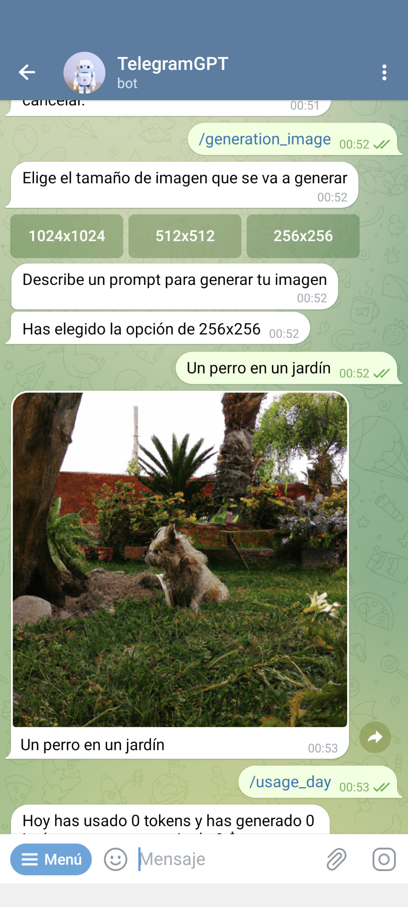
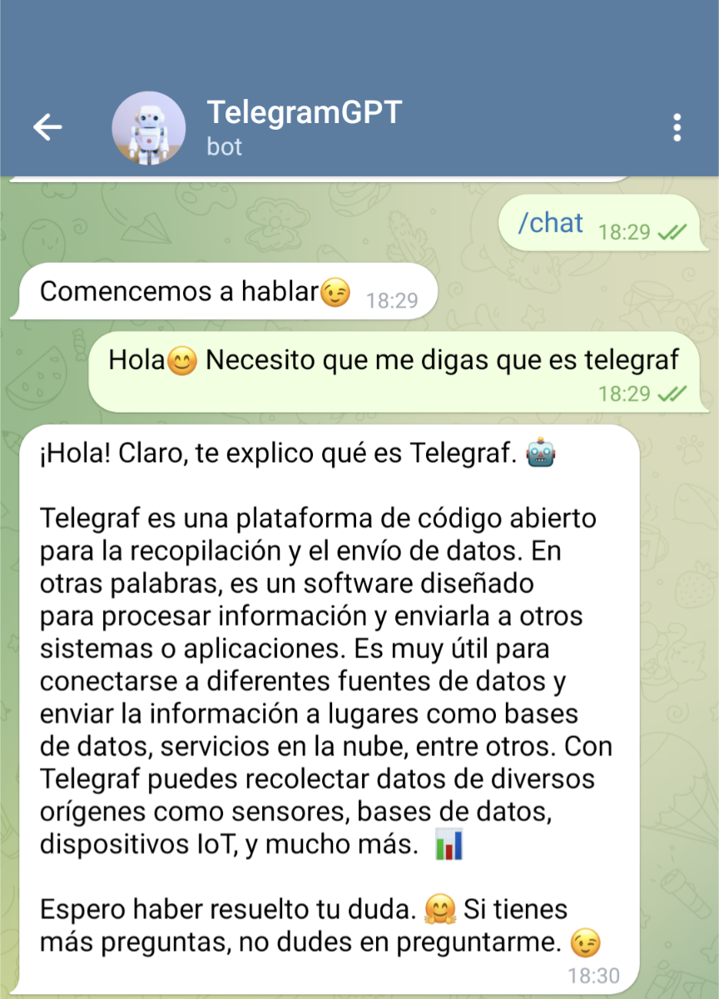
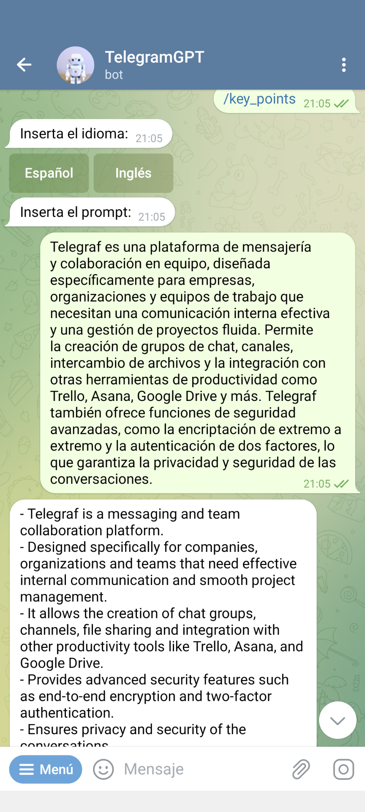
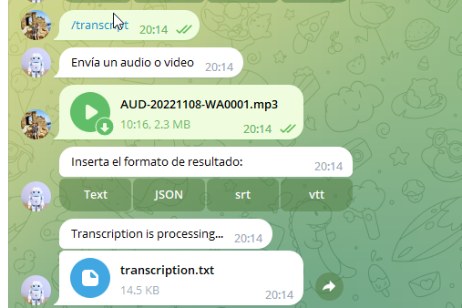
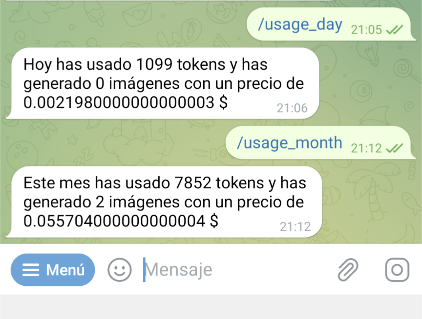

# TelegramGPTBot

<p align="center">
<a href="https://github.com/sky10p/TelegramGPT/blob/master/src/doc/donate/donate.md" alt="Donate shield"></a>
</p>

TelegramGPTBot is a Telegram bot built with Node.js and Telegraf that allows users to generate text, images and transcribe audio or video using OpenAI's GPT-3, DALL-E and Whisper models.

## Features
Generate images using Dall-e
Generate text using GPT-3
Transcribe audio or video using OpenAI's speech recognition API(Whisper).
Supports multiple languages

## Installation
1. Clone the repository:

```
git clone https://github.com/sky10p/TelegramGPTBot.git
```

2. Install dependencies

```
yarn install
```

3. Create a '.env' file with your Telegram bot token, Open AI Api key and other configuration variables:

```.env
TELEGRAM_BOT=your_bot_token_here
OPEN_AI_TOKEN=your_open_api_key_here
ALLOWED_USERS=allowed_users_telegram_ids
```

4. Start the bot:
yarn start

## Create your bot

Create your bot to use these code and get the key, you can add the actions to make easier work with it

### Actions

* help - Pide ayuda de cómo usar el bot
* chat - Empieza a conversar con TelegramGPT
* generation_image - Generar una imagen
* transcript - Transcript an audio or video
* summarize - Resumir un texto
* key_points - Devolver los puntos más importantes de un texto
* improve - Mejorar la calidad de un texto(mejor explicado)
* usage_day - Precio por día
* usage_month - Precio por mes
* cancel - Cancelar la operación actual

## Usage
To use the bot, you need to create your own Telegram bot first. You can follow the instructions on Telegram's Bot FAQ to create your own bot. Once you have created your bot, you can add the commands that are available in the doc/actions.txt file to your bot's commands list.

After that, you need to set your Telegram bot token and OpenAI API key in the .env file. Once you have done that, you can start the bot with the command yarn start.

## Dependencies
* [Node.js](https://nodejs.org/)
* [Telegraf](https://telegraf.js.org/)
* [Axios](https://github.com/axios/axios)
* [Dotenv](https://www.npmjs.com/package/dotenv)
* [OpenAI API](https://beta.openai.com/docs/api-reference/introduction)

## Features in development

* **I18n**: Internationalization support for the bot, allowing it to be used in different languages.
* **Inline query support**: Adding support for inline queries to allow users to generate images, text or transcriptions directly in a chat without the need to start a conversation with the bot.
* **Improving  the prompt for image generation**: The current prompt for image generation can be improved before generating the image.

## Contributing
Contributions are welcome! If you want to contribute to this project, please follow these steps:

1. Fork this repository.
2. Create a new branch with your feature or bug fix.
3. Commit your changes and push the branch to your forked repository.
4. Create a pull request to this repository.

## License
This project is licensed under the GNU General Public License v3.0. You can find more information in the [LICENSE](https://www.gnu.org/licenses/gpl-3.0.html) file.

## Examples

### Generating images using DALL-E
Use the /generation_image command to generate an image using DALL-E. Follow the bot's instructions to specify the image you want to generate.



### Generating images using DALL-E
Use the /generation_image command to generate an image using DALL-E. Follow the bot's instructions to specify the image you want to generate.


### Generating text using chat-gpt3
Use the /chat command to start a conversation with the bot. The bot will ask you what you want to talk about. Type your response and let the bot generate a response.

Use the /summarize command to summarize a text. Follow the bot's instructions to specify the text you want to summarize.

Use the /key_points command to get the key points of a text. Follow the bot's instructions to specify the text you want to get the key points of.

Use the /improve command to improve the quality of a text. Follow the bot's instructions to specify the text you want to improve.




### Transcript audio or video using Whisper API
Use the /transcript command to transcribe an audio or video file. Follow the bot's instructions to specify the file you want to transcribe.

If the result text is greater than allowed of 4096, it will be sended as a file.



### Pricing information
Use the /usage_day or /usage_month command to get pricing information.


