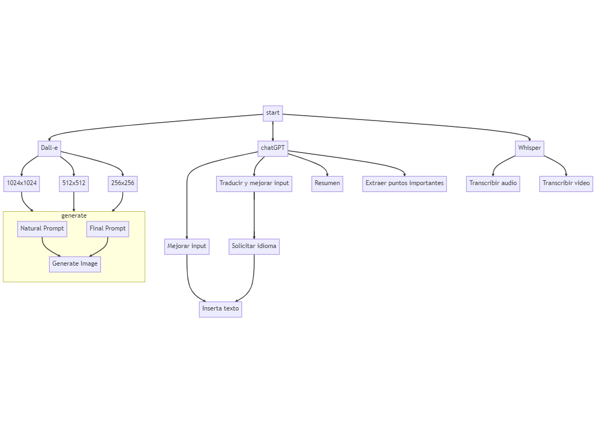

# TelegramGPTBot

TelegramGPTBot is a Telegram bot built with Node.js and Telegraf that allows users to generate text, images and transcribe audio or video using OpenAI's GPT-3, DALL-E and Whisper models.

## Features
Generate images using Dall-e
Generate text using GPT-3
Transcribe audio or video using OpenAI's speech recognition API(Whisper).
Supports multiple languages

## Installation
1. Clone the repository:

```
git clone https://github.com/sky10p/TelegramGPTBot.git
```

2. Install dependencies

```
yarn install
```

3. Create a '.env' file with your Telegram bot token, Open AI Api key and other configuration variables:

```.env
TELEGRAM_BOT=your_bot_token_here
OPEN_AI_TOKEN=your_open_api_key_here
ALLOWED_USERS=allowed_users_telegram_ids
```

4. Start the bot:
yarn start

## Create your bot

Create your bot to use these code and get the key, you can add the actions to make easier work with it

### Actions

* usage_day -> Cost per day
* usage_month -> Cost per month
* generation_image -> Generate an image
* cancel -> cancel any complex process with more than one step.
* summarize -> Summarize any text that you want in your native language.
* /key_points -> Get the most important points in your native language
* /improve -> Improve the input text in any language(native language or another)


## Flows
Png
